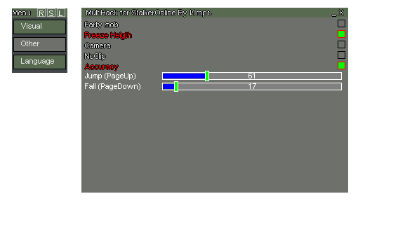

# SZOhack 
Visual and memory hack for SZone Online

    

Here is archived source code of my first programming project. __Its created on base of another cheat project__.
Its a second version of cheat, first version is lost and third version is [here](https://github.com/IgorKhramtsov/SZOHack-v3).  
All code leaved in the same state as it was written, except minimal changes done to make it compilable.

## Description
Its second, injectable, version of cheat. First version was autoinjectable by substitution of d3d9.dll  
Here is the functional:  
### Visual
- Wallhack
- Crosshair
- WireFrame
- Night light
### Memory
- Party mob (placing all the mobs into one point in front of the player)
- Freeze Height
- Free camera
- NoClip
- Increasing accuracy
- Manual jump/fall on a certain distance

## Dependencies  
To compile this code you need DirectX 9 SDK of June 2010.
Config `lib` and `include` folder in settings of solution.
  
## How to run
To run this code you need injector - [Xenos](https://github.com/DarthTon/Xenos) for example (use manual map injection type). And some app running on DirectX 9 (i attached some .exe i used in `misc` folder). All memhack functions wont run and disabled in code, otherwise app will crash right after inject. After compiling - select in injector `D3D9 Test.exe` file, compiled MultiHack.dll and click inject. Menu activates on __Home__ button.

# Warning!
Dont use this project in any game, its obsolete and open-sourced. Almost certainly you will be banned.
